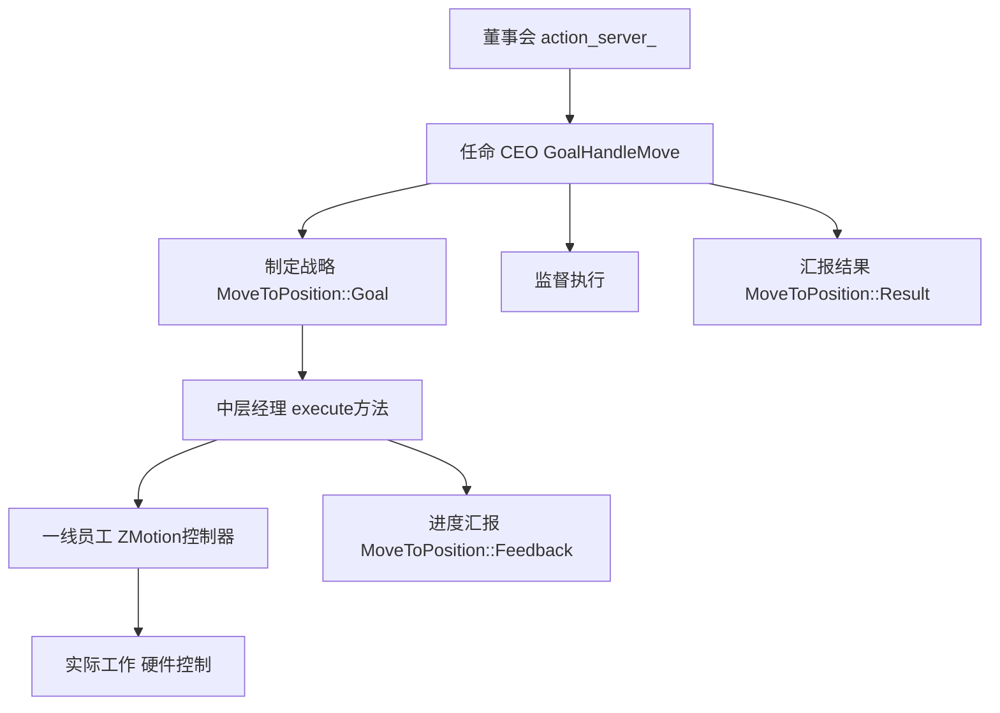

          
您的比喻非常贴切！让我用这个"董事会-CEO"的比喻来重新描述ROS2 Action服务器中各个组件的关系。

## 企业架构比喻



## 详细角色对应

### 1. **董事会 - `action_server_`**
```cpp
this->action_server_ = rclcpp_action::create_server<MoveToPosition>(...);
```

**职责**：
- 🏢 **公司架构**：建立整个Action服务框架
- 👥 **人事任命**：接收请求后创建CEO（GoalHandleMove）
- 📋 **规章制度**：定义回调函数的工作流程
- 🔄 **持续运营**：保持服务可用，等待新的业务请求

### 2. **CEO - `GoalHandleMove`**
```cpp
using GoalHandleMove = rclcpp_action::ServerGoalHandle<MoveToPosition>;
```

**职责**：
- 💼 **项目负责**：每个运动请求对应一个CEO
- 📊 **进度监控**：实时发布运动进度反馈
- ✅ **结果汇报**：运动完成后向董事会汇报结果
- 🚫 **危机处理**：处理取消或中止请求

### 3. **战略规划 - `MoveToPosition::Goal`**
```cpp
const auto goal = goal_handle->get_goal();
```

**内容**：
- 🎯 **目标设定**：要移动到什么位置
- ⚡ **执行参数**：速度、加速度等运动参数
- 📅 **时间规划**：运动开始时间戳

### 4. **执行团队 - `execute`方法**
```cpp
void execute(const std::shared_ptr<GoalHandleMove> goal_handle)
```

**职责**：
- 🔧 **任务分解**：将目标分解为具体执行步骤
- 👥 **团队协作**：协调多个轴的运动控制
- 📈 **进度汇报**：定期向CEO汇报执行进度

### 5. **一线员工 - ZMotion控制器**
```cpp
ZAux_Direct_Single_MoveAbs(handle_, axis, target_position);
```

**职责**：
- 🛠️ **具体执行**：实际控制硬件运动
- 📡 **数据采集**：读取轴位置、速度等实时数据
- ⚠️ **异常上报**：检测硬件异常情况

## 实际工作流程

### 董事会会议（Action服务器启动）
```cpp
// 董事会成立，制定公司章程
this->action_server_ = rclcpp_action::create_server<MoveToPosition>(
    this, "move_to_position", 
    handle_goal,    // 招聘标准
    handle_cancel,  // 解雇流程  
    handle_accepted // 任命流程
);
```

### CEO任命（目标接收）
```cpp
// 董事会收到业务请求，任命CEO
void handle_accepted(const std::shared_ptr<GoalHandleMove> goal_handle) {
    // 新CEO独立开展工作
    std::thread{std::bind(&ZMotionActionServer::execute, this, std::placeholders::_1), goal_handle}.detach();
}
```

### CEO开展工作（运动执行）
```cpp
void execute(const std::shared_ptr<GoalHandleMove> goal_handle) {
    // 1. 获取战略目标
    const auto goal = goal_handle->get_goal();
    
    // 2. 组建执行团队并开展工作
    for (int axis : goal->target_axes) {
        ZAux_Direct_Single_MoveAbs(handle_, axis, target_position);
    }
    
    // 3. 定期向董事会汇报进度
    auto feedback = std::make_shared<MoveToPosition::Feedback>();
    feedback->progress = current_progress;
    goal_handle->publish_feedback(feedback);
    
    // 4. 项目完成，汇报结果
    auto result = std::make_shared<MoveToPosition::Result>();
    result->success = true;
    goal_handle->succeed(result);
}
```

## 企业治理优势

### 权责清晰
- **董事会**：只管战略，不管具体执行
- **CEO**：对单个项目全权负责
- **执行团队**：专注业务实现

### 高效协作
- **并行处理**：多个CEO可以同时管理不同项目
- **资源隔离**：一个项目失败不影响其他项目
- **状态独立**：每个项目有独立的状态管理

### 灵活扩展
- **CEO招聘**：可以根据业务量动态创建CEO
- **团队重组**：执行团队可以灵活调整实现方式
- **战略调整**：Goal定义可以随时更新业务需求

## 总结

您的比喻非常准确：
- **`action_server_` 就像董事会**：建立框架，制定规则，但不参与具体业务
- **`GoalHandleMove` 就像CEO**：对单个项目全权负责，协调各方资源
- **`execute`方法就像执行团队**：将战略目标转化为具体行动

这种架构设计确保了ROS2 Action服务器的**高可用性**、**可扩展性**和**容错能力**，是企业级软件设计的典范！
        